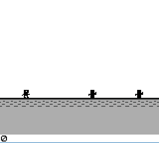

# DinoRun
A dinosaur endless runner Game Boy game.

---

---

### Requirements:
- [Game Boy Development Kit (GBDK)](https://github.com/Zal0/gbdk-2020)
- Any Gameboy emulator

---

### How To Compile:
1. Clone repository using `git clone https://github.com/ThaiDuongVu/DinoRun.git`
2. Compile main.c using 2 commands:

    `[Path to gbdk]/bin/lcc -Wa-l -Wl-m -Wl-j -DUSE_SFR_FOR_REG -c -o main.o main.c`
    `[Path to gbdk]/bin/lcc -Wa-l -Wl-m -Wl-j -DUSE_SFR_FOR_REG -o main.gb main.o`

3. Run the generated `main.gb` file using a Game Boy emulator.
